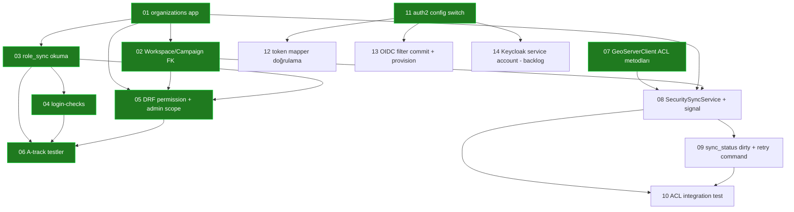

# Epic 11 — Ticket Dağılımı (Auth + Org-Scope + GeoServer ACL)

> **Kaynak:** `docs/development/epic-11-canonical.md` (TEK canonical karar kaynağı).
> Bu klasör, o belgeyi **local agent'ların tek başına takip edip bitirebileceği** dikey dilimlere (tracer-bullet ticket) böler.
> Bir çelişki olursa **canonical belge kazanır** — bu ticket'lar onun uygulama izdüşümüdür, karar merci değildir.
>
> **Oluşturulma:** 2026-08-12. **Ticket yazımı sırasında kodun gerçek durumu incelendi** (jcodemunch index) ve
> her ticket "şu an ne VAR" notuyla işaretlendi — plan (§11) ile mevcut kodun arasındaki fark gerçek koda göre yazıldı.

---

## 0. Bir agent bu klasörü nasıl kullanır

1. **Önce `epic-11-canonical.md`'yi oku.** Ticket'lar oradaki §-numaralarına atıf yapar; kararın "neden"i orada.
2. **Frontier'ı seç:** "Blocked by" satırındaki tüm ticket'lar `DONE` olan, ilk `ready-for-agent` ticket'ı al.
3. Ticket'ı baştan sona uygula, **tüm acceptance criteria** kutucuklarını doğrula.
4. Ticket'ın **Doğrulama** komutunu çalıştır, yeşil olduğunu gör.
5. Bittiğinde ticket dosyasının **Status**'ünü `done` yap ve bu README'deki durum tablosunu güncelle.
6. Kod düzenledikten sonra (jcodemunch kuralı): `register_edit` ile düzenlenen path'leri bildir.

**Bir ticket = bir taze context penceresi.** Ticket'lar buna göre boyutlandı; bir ticket'ı bitirmeden diğerine geçme.

---

## 1. Durum tablosu (2026-08-12 itibarıyla)

| # | Ticket | Track | Durum | Blocked by |
|---|--------|-------|-------|-----------|
| 01 | `organizations` app + `Organization` modeli | A | ✅ done | — |
| 02 | Workspace & Campaign `organization` FK (expand→backfill→contract) | A | ✅ done | 01 |
| 03 | `role_sync`: `default_organization` + `ROLE_<SLUG>_*` okuma + level map | A | ✅ done | 01 |
| 04 | İki login-check (org-presence, org-role coherence) | A | ✅ done | 03 |
| 05 | Org-scoped DRF permission class + Django admin scoping | A | ✅ done | 01, 02, 03 |
| 06 | A-track unit testleri (token fixture, infra'sız) | A | ✅ done | 03, 04, 05 |
| 07 | `GeoServerClient` ACL layer-rule metodları (`add/update/delete`) | C | ✅ done | — |
| 08 | `GeoServerSecuritySyncService` + Workspace `post_save` signal | C | 🔲 ready-for-agent | 01, 02, 07 |
| 09 | ACL hata yolu: `sync_status=dirty` + `sync_acl` retry command | C | 🔲 blocked | 08 |
| 10 | GeoServer ACL integration test (gerçek GeoServer) | C | 🔲 blocked | 08, 09 |
| 11 | auth2 config switch: `.env.dev` / `base.py` / `.env.example` | B | ✅ done | — |
| 12 | auth2/`tosca-dev` token mapper canlı doğrulama | B | 🔲 ready-for-agent (gerçek Keycloak login gerektirir, agent kapsamı dışı) | 11 |
| 13 | GeoServer OIDC auth filter config commit + provision + auth2 repoint | B | 🔲 ready-for-agent | 11 |
| 14 | (Backlog) Django Keycloak service account (Admin API / reconcile) | — | 🔲 backlog (POC dışı) | 11 |

> Durum işaretleri: ✅ done · 🔲 ready-for-agent (blocker'ları done) · 🔲 blocked (blocker bekliyor) · 🔲 backlog (POC dışı, canonical §4b/§10b).

---

## 2. Bağımlılık grafiği

**Paralel çalışılabilecek üç frontier** (birbirinden bağımsız):
- **A-track:** ✅ tamamlandı (01-06).
- **C-track:** 07 ✅ done → **08 şimdi ready-for-agent** → 09 → 10.
- **B-track:** 11 ✅ done → **12 ve 13 şimdi ready-for-agent** (12 gerçek Keycloak login gerektirdiğinden ajan kapsamı dışı kalabilir).

Üç track paralel yürüyebilir; hepsi bittiğinde Epic 11'in **auth + org-scope + ACL** kapsamı tamam olur.

---

## 3. Konvansiyonlar (canonical §1, §2)

- **Yetki yönü:** Keycloak = kimlik + rol ataması **canonical**. Django = uygulayıcı, **Keycloak'a asla yazmaz**. GeoServer = enforcement point.
- **Rol ismi:** `ROLE_<SLUG>_<LEVEL>`, `<SLUG>` = `Organization.slug` (büyük harf), `<LEVEL>` ∈ `{READER, WRITER, ADMIN}`. **`ORG` infix'i YOK.** Slug atomiktir, parse edilmez — sadece **türetilir ve token'da eşleştirilir**.
- **Level yetenekleri (§2b):** READER=oku · WRITER=oluştur+düzenle (Django'da silme YOK) · ADMIN=+sil. GeoServer'da `.w` create/edit/delete'i ayıramaz → GeoServer planında writer=admin=`.w` (bilinçli trade-off, §7).
- **Platform rolleri** (`ADMIN`, `GROUP_ADMIN`, `DJANGO_SUPERADMIN`) **org-gruplarına ASLA map edilmez** (§2 🔒 yetki-yükseltme kuralı). `DJANGO_STAFF` → `is_staff`, `DJANGO_SUPERADMIN` → `is_superuser`.
- **ACL kural formatı (canlı doğrulandı §5c):** key = `<workspace>.<layer>.<access>`, access ∈ `{r, w, a}`, `<layer>=*` workspace-geneli. Değer = virgülle ayrılmış roller. Yeni key → `POST`, güncelle → `PUT`, sil → `DELETE /rest/security/acl/layers/{key}`.
- **Cross-org erişim → 404** (403 değil, §10a). **Token TTL = 30 dk.** ACL push hatası → `sync_status=dirty` + retry command (outbox/framework YOK).
- **default_org:** token'daki **scalar** `default_organization` claim'inden okunur (canlı doğrulandı). Çoklu-org üyelik listesi token'da **YOK** — gerekince mapper'a `organization` array eklenir ya da Admin API'den okunur (backlog, ticket 14).

---

## 4. Kapsam DIŞI (bu klasörde ticket YOK)

- **Storage / S3 (canonical §10b):** presigned upload, `MediaAsset` (Issue 48), SSRF hardening (Issue 10), derivative pipeline. **Tamamen açık, karar verilmedi** — ayrı bir epic. Bkz. `epic-11_s3-production-media-roadmap.md`.
- **Çoklu-org üyelik:** token'da liste yok; Admin API dalı ticket 14'te backlog.
- **Org'lar arası layer-level paylaşım:** canonical §6 → v2. POC'ta paylaşım = ayrı shared workspace, `shared_with` M2M **yok**.
- **GeoServer direct-write sıkılaştırma:** canonical §7 bilinçli trade-off olarak **korunur**; kapatma ileride.
- **Keycloak delegated-admin / FGAP** (org-admin'in başka kullanıcıyı yönetmesi): canonical §2b → sonraki iş.

---

## 5. Test komutları (canonical §11 Zemin)

- Unit (infra'sız): `make django-test-unit` → docker `django`, `uv run pytest -m 'not integration'`.
- Integration (gerçek GeoServer): `make django-test-integration`.
- Ortam: lokal docker stack. Keycloak = `auth2.dcs.hcu-hamburg.de`, realm = `tosca-dev`, client = `django-dev`.
