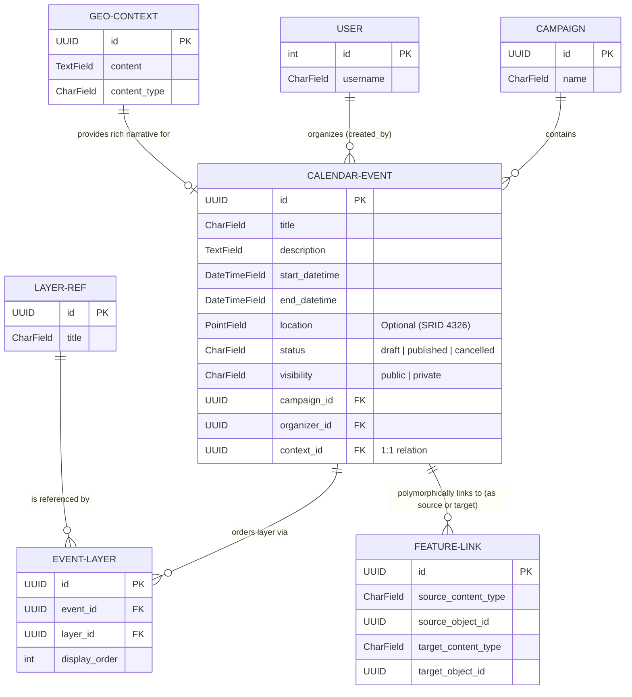

# Calendar Event ER Diagram

The following Entity-Relationship diagram outlines the technical database schema for `CalendarEvent` within the TOSCA-Backend. It illustrates how an event integrates with its parent campaign, its author, the core narrative context, map layers, and polymorphic feature links.

