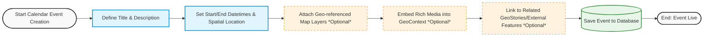

# Calendar Event Workflow Diagram

Based on the TOSCA-Backend data architecture, the following diagram illustrates the streamlined life-cycle of creating and publishing a Calendar Event.

```mermaid
flowchart LR
    %% Define Styles
    classDef startend fill:#f9f9f9,stroke:#333,stroke-width:2px,rx:20,ry:20
    classDef process fill:#e1f5fe,stroke:#0288d1,stroke-width:2px
    classDef database fill:#e8f5e9,stroke:#388e3c,stroke-width:2px,shape:cylinder
    classDef optional fill:#fff3e0,stroke:#f57c00,stroke-width:1px,stroke-dasharray: 5 5

    %% Nodes
    A([Start Calendar Event Creation]):::startend
    B[Define Title & Description]:::process
    C[Set Start/End Datetimes & Spatial Location]:::process
    D[Attach Geo-referenced Map Layers *Optional*]:::optional
    E[Embed Rich Media into GeoContext *Optional*]:::optional
    F[Link to Related GeoStories/External Features *Optional*]:::optional
    G[(Save Event to Database)]:::database
    H([End: Event Live]):::startend

    %% Flow
    A --> B
    B --> C
    C --> D
    D --> E
    E --> F
    F --> G
    G --> H
```
