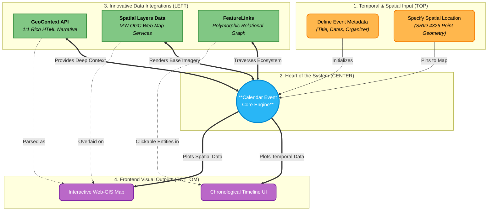

# Technical Structure: Calendar Module Integration

This architectural illustration explains the process and innovation of how the **Calendar Module** acts as an integrated multimedia hub, combining temporal data, spatial contexts, and rich narratives into a cohesive user experience.

### Key Innovations Explained:

1. **Spatial-Temporal Duality:** The core engine natively processes items both chronologically (start/end boundaries) and spatially (GIS coordinate nodes).
2. **Pluggable Narrative Architecture (GeoContext):** Instead of forcing rich-text into the event table, an independent context block allows limitless multimedia potential without bloating the timeline index.
3. **Cross-Service Ecosystem Graph (FeatureLinks):** The event is not isolated. A polymorphic relationship enables an event to natively point to associated `GeoStories` or `Citizen Feedback` campaigns inside the database context tree.
4. **Dynamic Cartography Rendering:** Abstracting layers from events lets the Interactive Web-GIS map dynamically composite OGC maps alongside the specific time-bound geometries.
