# GeoStory Event Feedback System - Database Schema V2

This document describes the proposed full-platform v2 schema. It keeps the original platform scope from [database_schema.md](/Users/gokturkburakkose/Documents/dev/TOSCA-Backend/docs/features-to-add/database_schema.md) while replacing the old `CalendarEvent` structure with the new event model.

## Entity Relationship Diagram

```mermaid
%%{init: {'theme':'base', 'themeVariables': { 'primaryColor':'#e8f4f8','primaryTextColor':'#1a1a1a','primaryBorderColor':'#2c5282','lineColor':'#4a5568','secondaryColor':'#f0f9ff','tertiaryColor':'#fef3c7'}}}%%
erDiagram
    direction LR
    
    %% ═════════════════════════════════════════════════════
    %% █ CORE ENTITIES
    %% ═════════════════════════════════════════════════════
    
    USER:::coreModel {
        UUID id PK
        VARCHAR username
        VARCHAR email
    }

    CAMPAIGN:::coreModel {
        UUID id PK
        VARCHAR title
        TEXT summary
        ENUM status "draft, active, archived"
        ENUM visibility "public, private"
        UUID created_by_id FK
        TIMESTAMPTZ created_at
        TIMESTAMPTZ updated_at
    }

    LAYERREF:::coreModel {
        UUID id PK
        VARCHAR layer_name UK "workspace:layer format"
        TIMESTAMPTZ created_at
    }

    GEOCONTEXT:::coreModel {
        UUID id PK
        TEXT content
        ENUM content_type "simple, rich"
        UUID created_by_id FK
        TIMESTAMPTZ created_at
        TIMESTAMPTZ updated_at
    }

    %% ═════════════════════════════════════════════════════
    %% █ CONTENT FEATURES - enriched by GeoContext
    %% ═════════════════════════════════════════════════════
    
    GEOSTORY:::contentModel {
        UUID id PK
        UUID campaign_id FK
        VARCHAR title
        TEXT summary
        ENUM status "draft, published, archived"
        UUID author_id FK
        UUID cover_media_id FK
        UUID context_id FK "optional"
        TIMESTAMPTZ created_at
        TIMESTAMPTZ updated_at
    }

    GEOFEEDBACK:::contentModel {
        UUID id PK
        UUID campaign_id FK
        VARCHAR title
        TEXT description
        BOOL rating_enabled
        BOOL form_enabled
        BOOL allow_drawings
        UUID custom_form_id FK "nullable"
        UUID context_id FK "optional"
        ENUM status "draft, published, closed"
        ENUM visibility "public, private"
        UUID created_by_id FK
        TIMESTAMPTZ created_at
        TIMESTAMPTZ updated_at
    }

    %% ═════════════════════════════════════════════════════
    %% █ EVENT DOMAIN - types, series, and occurrences
    %% ═════════════════════════════════════════════════════
    
    EVENT_TYPE:::eventModel {
        UUID id PK
        VARCHAR code UK
        VARCHAR label
        VARCHAR profile_mode "core, extension"
        VARCHAR profile_key "nullable"
        BOOL is_active
        TIMESTAMPTZ created_at
        TIMESTAMPTZ updated_at
    }

    EVENT_SERIES:::eventModel {
        UUID id PK
        UUID campaign_id FK
        UUID event_type_id FK
        UUID created_by_id FK
        UUID default_context_id FK "optional shared context"
        VARCHAR name
        ENUM series_mode "manual_batch, recurring"
        ENUM recurrence_type "daily, weekly, monthly"
        DATE start_date
        DATE end_date "nullable"
        INT occurrence_count "nullable"
        INT interval
        TIME start_time
        TIME end_time
        VARCHAR timezone
        ENUM monthly_rule_type "day_of_month, nth_weekday"
        INT day_of_month "nullable"
        INT week_of_month "nullable"
        VARCHAR weekday_of_month "nullable"
        JSONB by_weekday
        TEXT notes
        TIMESTAMPTZ created_at
        TIMESTAMPTZ updated_at
    }

    EVENT_SERIES_DATE:::eventModel {
        UUID id PK
        UUID series_id FK
        DATE occurrence_date
        INT display_order
    }

    EVENT:::eventModel {
        UUID id PK
        UUID campaign_id FK
        UUID series_id FK "nullable"
        UUID event_type_id FK
        UUID organizer_id FK
        UUID context_id FK "optional"
        VARCHAR external_id "nullable import id"
        VARCHAR title
        TEXT description
        TIMESTAMPTZ start_datetime
        TIMESTAMPTZ end_datetime
        VARCHAR timezone
        ENUM status "draft, published, cancelled, archived"
        ENUM visibility "public, private"
        ENUM location_mode "physical, online, hybrid"
        GEOMETRY location "Point 4326, nullable"
        VARCHAR venue_name
        TEXT address_text
        VARCHAR online_url
        VARCHAR online_platform
        TEXT access_notes
        VARCHAR provider_name
        VARCHAR provider_url
        TEXT provider_contact
        INT occurrence_index "nullable"
        BOOL is_exception
        TIMESTAMPTZ original_start_datetime "nullable"
        JSONB metadata
        TIMESTAMPTZ created_at
        TIMESTAMPTZ updated_at
    }

    %% ═════════════════════════════════════════════════════
    %% █ EVENT EXTENSION PROFILES - domain-specific data
    %% ═════════════════════════════════════════════════════
    
    PUBLIC_HEALTH_EVENT_PROFILE:::eventModel {
        UUID event_id PK
        BOOL referral_required
        BOOL insurance_eligible
        BOOL clinical_setting
        JSONB health_metadata
        TIMESTAMPTZ created_at
        TIMESTAMPTZ updated_at
    }

    SPORTS_EVENT_PROFILE:::eventModel {
        UUID event_id PK
        JSONB sports_metadata
        TIMESTAMPTZ created_at
        TIMESTAMPTZ updated_at
    }

    CULTURE_EVENT_PROFILE:::eventModel {
        UUID event_id PK
        JSONB culture_metadata
        TIMESTAMPTZ created_at
        TIMESTAMPTZ updated_at
    }

    %% ═════════════════════════════════════════════════════
    %% █ TAXONOMY - dynamic classification system
    %% ═════════════════════════════════════════════════════
    
    TAXONOMY_DIMENSION:::taxonomyModel {
        UUID id PK
        VARCHAR code UK
        VARCHAR label
        TEXT description
        ENUM selection_mode "single, multiple"
        BOOL is_active
        BOOL is_system
        INT sort_order
        JSONB config
        TIMESTAMPTZ created_at
        TIMESTAMPTZ updated_at
    }

    TAXONOMY_TERM:::taxonomyModel {
        UUID id PK
        UUID dimension_id FK
        UUID parent_term_id FK "nullable"
        VARCHAR code
        VARCHAR label
        TEXT description
        BOOL is_active
        INT sort_order
        JSONB metadata
        TIMESTAMPTZ created_at
        TIMESTAMPTZ updated_at
    }

    EVENT_TERM:::eventModel {
        UUID id PK
        UUID event_id FK
        UUID term_id FK
        TIMESTAMPTZ created_at
    }

    %% ═════════════════════════════════════════════════════
    %% █ FEEDBACK & FORMS - user submissions
    %% ═════════════════════════════════════════════════════
    
    CUSTOM_FORM:::contentModel {
        UUID id PK
        VARCHAR name
        VARCHAR slug UK
        JSONB json_schema
        ENUM status
    }

    FEEDBACKSUBMISSION:::contentModel {
        UUID id PK
        UUID feedback_id FK
        UUID user_id FK "nullable"
        INT rating "1-5, nullable"
        JSONB form_data
        GEOMETRY geometry "Any geometry type"
        BOOL is_anonymized
        TIMESTAMPTZ created_at
    }

    %% ═════════════════════════════════════════════════════
    %% █ JUNCTION TABLES - many-to-many relationships
    %% ═════════════════════════════════════════════════════
    
    GEOSTORY_LAYER:::junctionModel {
        UUID id PK
        UUID geostory_id FK
        UUID layer_id FK
        INT display_order
        TIMESTAMPTZ created_at
    }

    EVENT_LAYER:::junctionModel {
        UUID id PK
        UUID event_id FK
        UUID layer_id FK
        INT display_order
        TIMESTAMPTZ created_at
    }

    FEEDBACK_LAYER:::junctionModel {
        UUID id PK
        UUID feedback_id FK
        UUID layer_id FK
        INT display_order
        TIMESTAMPTZ created_at
    }

    FEATURELINK:::junctionModel {
        UUID id PK
        UUID campaign_id FK
        INT source_content_type_id FK
        UUID source_object_id
        INT target_content_type_id FK
        UUID target_object_id
        ENUM link_type "direct, read_more, action"
        UUID created_by_id FK
        TIMESTAMPTZ created_at
    }

    %% ═════════════════════════════════════════════════════
    %% █ RELATIONSHIPS
    %% ═════════════════════════════════════════════════════
    
    %% ─────────────────────────────────────────────────────
    %% Core ownership relationships
    %% ─────────────────────────────────────────────────────
    CAMPAIGN ||--o{ GEOSTORY : "contains"
    CAMPAIGN ||--o{ GEOFEEDBACK : "contains"
    CAMPAIGN ||--o{ EVENT : "contains"
    CAMPAIGN ||--o{ EVENT_SERIES : "contains"
    CAMPAIGN ||--o{ FEATURELINK : "scopes"

    USER ||--o{ CAMPAIGN : "creates"
    USER ||--o{ GEOCONTEXT : "creates"
    USER ||--o{ GEOSTORY : "authors"
    USER ||--o{ GEOFEEDBACK : "creates"
    USER ||--o{ EVENT : "organizes"
    USER ||--o{ EVENT_SERIES : "creates"
    USER ||--o{ FEATURELINK : "creates"
    USER ||--o{ FEEDBACKSUBMISSION : "submits"

    %% ─────────────────────────────────────────────────────
    %% GeoContext enriches content features
    %% ─────────────────────────────────────────────────────
    GEOCONTEXT ||--o{ GEOSTORY : "enriches"
    GEOCONTEXT ||--o{ GEOFEEDBACK : "enriches"
    GEOCONTEXT ||--o{ EVENT : "enriches"
    GEOCONTEXT ||--o{ EVENT_SERIES : "defaults for"

    %% ─────────────────────────────────────────────────────
    %% Event domain relationships
    %% ─────────────────────────────────────────────────────
    EVENT_TYPE ||--o{ EVENT_SERIES : "classifies"
    EVENT_TYPE ||--o{ EVENT : "classifies"
    EVENT_SERIES ||--o{ EVENT : "groups"
    EVENT_SERIES ||--o{ EVENT_SERIES_DATE : "stores dates"

    %% ─────────────────────────────────────────────────────
    %% Event extension profiles
    %% ─────────────────────────────────────────────────────
    EVENT ||--o| PUBLIC_HEALTH_EVENT_PROFILE : "extends if public_health"
    EVENT ||--o| SPORTS_EVENT_PROFILE : "extends if sports"
    EVENT ||--o| CULTURE_EVENT_PROFILE : "extends if culture"

    %% ─────────────────────────────────────────────────────
    %% Event taxonomy
    %% ─────────────────────────────────────────────────────
    TAXONOMY_DIMENSION ||--o{ TAXONOMY_TERM : "owns"
    EVENT ||--o{ EVENT_TERM : "tagged by"
    TAXONOMY_TERM ||--o{ EVENT_TERM : "assigned to"

    %% ─────────────────────────────────────────────────────
    %% Layer references for all features
    %% ─────────────────────────────────────────────────────
    GEOSTORY ||--o{ GEOSTORY_LAYER : "orders layers"
    GEOFEEDBACK ||--o{ FEEDBACK_LAYER : "orders layers"
    EVENT ||--o{ EVENT_LAYER : "orders layers"
    LAYERREF ||--o{ GEOSTORY_LAYER : "is referenced by"
    LAYERREF ||--o{ FEEDBACK_LAYER : "is referenced by"
    LAYERREF ||--o{ EVENT_LAYER : "is referenced by"

    %% ─────────────────────────────────────────────────────
    %% Feedback forms
    %% ─────────────────────────────────────────────────────
    GEOFEEDBACK }o--o| CUSTOM_FORM : "uses schema from"
    GEOFEEDBACK ||--o{ FEEDBACKSUBMISSION : "receives"

    classDef coreModel fill:#e0f2fe,stroke:#0369a1,color:#0f172a,stroke-width:2px
    classDef contentModel fill:#f3e8ff,stroke:#7c3aed,color:#2e1065,stroke-width:2px
    classDef eventModel fill:#dcfce7,stroke:#15803d,color:#14532d,stroke-width:2px
    classDef taxonomyModel fill:#fef3c7,stroke:#b45309,color:#78350f,stroke-width:2px
    classDef junctionModel fill:#f3f4f6,stroke:#6b7280,color:#111827,stroke-width:1,5px
```

Note: the self-referential `TaxonomyTerm.parent_term_id` hierarchy is intentionally omitted from the main Mermaid ER diagram because Mermaid tends to render self-loops with long, distracting connector paths in large schemas. The hierarchy is still part of the model and is documented in the taxonomy constraints below.

---

## FeatureLink: Direct Linking Between Features

FeatureLink continues to provide **M:N direct linking** between platform features within the same campaign.

### Allowed Link Combinations

| Source | Target | Description |
| --- | --- | --- |
| GeoStory | GeoStory | Story references another story |
| GeoStory | Event | Story links to related event |
| GeoStory | GeoFeedback | Story links to feedback form |
| Event | GeoStory | Event references related story |
| Event | Event | Event links to another event |
| Event | GeoFeedback | Event links to feedback form |
| GeoFeedback | GeoStory | Feedback references related story |
| GeoFeedback | Event | Feedback links to related event |
| GeoFeedback | GeoFeedback | Feedback links to another form |

### Constraints

- **Same campaign**: source and target must belong to the same campaign
- **No self-links**: an entity cannot link to itself
- **No duplicates**: each source-target pair is unique
- **Validation**: linked content types must be platform feature entities

---

## Junction Tables

### geostory_layers

| Column | Type | Description |
| --- | --- | --- |
| `id` | UUID PK | Primary key |
| `geostory_id` | UUID FK | References `geostory` |
| `layer_id` | UUID FK | References `layerref` |
| `display_order` | INT | Layer stacking order |

Constraint:

- `UNIQUE(geostory_id, layer_id)`

### event_layers

| Column | Type | Description |
| --- | --- | --- |
| `id` | UUID PK | Primary key |
| `event_id` | UUID FK | References `event` |
| `layer_id` | UUID FK | References `layerref` |
| `display_order` | INT | Layer stacking order |

Constraint:

- `UNIQUE(event_id, layer_id)`

### feedback_layers

| Column | Type | Description |
| --- | --- | --- |
| `id` | UUID PK | Primary key |
| `feedback_id` | UUID FK | References `geofeedback` |
| `layer_id` | UUID FK | References `layerref` |
| `display_order` | INT | Layer stacking order |

Constraint:

- `UNIQUE(feedback_id, layer_id)`

### event_term

| Column | Type | Description |
| --- | --- | --- |
| `id` | UUID PK | Primary key |
| `event_id` | UUID FK | References `event` |
| `term_id` | UUID FK | References `taxonomy_term` |
| `created_at` | TIMESTAMPTZ | Assignment timestamp |

Constraint:

- `UNIQUE(event_id, term_id)`

### event_series_date

| Column | Type | Description |
| --- | --- | --- |
| `id` | UUID PK | Primary key |
| `series_id` | UUID FK | References `event_series` |
| `occurrence_date` | DATE | Explicit chosen date |
| `display_order` | INT | UI ordering |

Constraint:

- `UNIQUE(series_id, occurrence_date)`

---

## Key Design Decisions in V2

### GeoContext Reuse

Unlike the v1 event model, event context is no longer modeled as a strict 1:1 content row.

Reason:

- `EventSeries.default_context_id` stores the shared default context for a series
- `Event.context_id` is an optional per-occurrence override
- effective context resolution is `event.context` -> `series.default_context` -> none
- events without any effective context are valid

`GeoStory` and `GeoFeedback` may stay 1:1 or move to the same pattern later, depending on product direction.

### Event Core Ownership

The following stay directly on `Event`:

- location and online access data
- provider data
- schedule
- basic content

This avoids premature `Location` or `Provider` entities and keeps authoring simple.

### Dynamic Taxonomy

Event classification is no longer hardcoded. Instead:

- `TaxonomyDimension` defines a bucket such as `topic` or `language`
- `TaxonomyTerm` defines values inside one bucket
- `EventTerm` attaches terms to events

This supports open-source adaptability and deployment-specific vocabularies.

### Event Type Registry and Profiles

`EventType` controls whether an event:

- is fully represented by the event core
- or requires a domain-specific extension profile

Binding rule:

- `profile_mode=core` -> no extension row expected
- `profile_mode=extension` -> only the matching profile table is valid

### EventSeries and Exceptions

`EventSeries` is a lightweight grouping and recurrence-definition model.

It does not own the actual event data. Each occurrence is still a normal `Event`.

Per-occurrence edits are tracked through:

- `is_exception`
- `original_start_datetime`
- `occurrence_index`

While an event remains attached to a series, it stays bound to that series for:

- `campaign_id`
- `event_type_id`

Exceptions may diverge on schedule, content, or location, but not on `campaign_id` or `event_type_id` unless detached from the series.

### Map / List Output Semantics

The v2 API design assumes:

- shared filters between map and list endpoints
- different response shapes
- map response returns:
  - `spatial_events` as GeoJSON
  - `online_events` as a plain JSON array
- list response returns one paginated mixed stream ordered by `start_datetime`
- `location_mode` tells clients whether a list item is `physical`, `hybrid`, or `online`
- spatial filters constrain only `physical` and `hybrid`
- `online` events bypass spatial predicates but still use all non-spatial filters

---

## Suggested Constraints Summary

### Event

- `end_datetime >= start_datetime`
- `location_mode IN ('physical', 'online', 'hybrid')`
- `physical` events require location
- `hybrid` events require location and online URL
- `online` events require online URL and may have `location = NULL`
- `context_id` is nullable
- `(series_id, occurrence_index)` should be unique when `series_id` is not null
- `is_exception=true` requires `series_id`
- if `series_id` is set, `campaign_id` must equal the series campaign
- if `series_id` is set, `event_type_id` must equal the series event type

### EventSeries

- `series_mode IN ('manual_batch', 'recurring')`
- recurring series require `recurrence_type`
- `default_context_id` is nullable
- exactly one end strategy:
  - `end_date`
  - or `occurrence_count`
- weekly recurrence requires at least one weekday
- monthly recurrence requires either:
  - `day_of_month`
  - or `week_of_month + weekday_of_month`
- recurrence is defined in local wall time using a required IANA timezone
- generated occurrences keep the same local time across DST transitions

### EventSeriesDate

- `UNIQUE(series_id, occurrence_date)`
- `display_order >= 1`

### Taxonomy

- `TaxonomyDimension.code` unique
- `UNIQUE(dimension_id, code)` on `TaxonomyTerm`
- parent and child terms must belong to the same dimension
- `UNIQUE(event_id, term_id)` on `EventTerm`

### Profiles

- profile row allowed only when it matches the event type binding

## Recommended Indexes

- `Event.location` GiST
- `Event(campaign_id, status, start_datetime)`
- `Event(event_type_id, start_datetime)`
- `Event(location_mode, start_datetime)`
- `Event(series_id, start_datetime)`
- unique partial index on `(series_id, occurrence_index)` where `series_id IS NOT NULL`
- `EventSeriesDate(series_id, occurrence_date)` unique
- `TaxonomyTerm(dimension_id, code)` unique
- `EventTerm(event_id, term_id)` unique
- `EventTerm(term_id, event_id)` index

---

## Migration Orientation

Suggested migration sequence:

1. Introduce `EventType`
2. Finalize the event schema and replace `CalendarEvent` with `Event`
3. Add `EventSeries.default_context` plus optional `Event.context` override
4. Introduce taxonomy tables
5. Introduce `EventSeries` and `EventSeriesDate`
6. Introduce event profile tables
7. Refactor map/list APIs

Because the system is not yet in production, rollout may use a destructive pre-production DB reset instead of row-level data backfill.

---

## Related Documents

- [proposed-event-model.md](/Users/gokturkburakkose/Documents/dev/TOSCA-Backend/docs/features-to-add/proposed-event-model.md)
- [database_schema.md](/Users/gokturkburakkose/Documents/dev/TOSCA-Backend/docs/features-to-add/database_schema.md)
- [technical-architecture.md](/Users/gokturkburakkose/Documents/dev/TOSCA-Backend/docs/features-to-add/technical-architecture.md)
