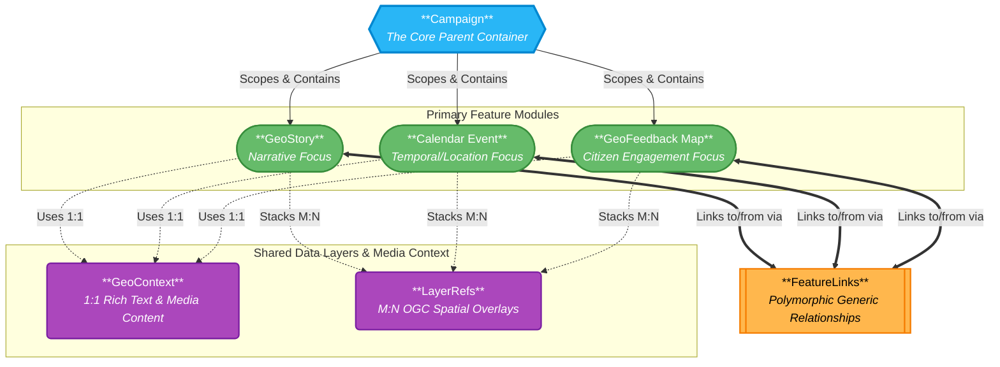

# TOSCA Platform Technical Architecture

This high-level schematic illustrates the structural relationships between the core entity, the three primary feature modules (`GeoStory`, `Calendar Event`, `GeoFeedback Map`), and the shared integration data models within the backend ecosystem.

### Architectural Breakdown

Based on the system's database schema:

1. **The Campaign Node**: All structural data must originate from a `Campaign`. It acts as the definitive scope boundary for stories, events, and feedback campaigns.
2. **The 3 Independent Modules**: `GeoStory`, `CalendarEvent`, and `GeoFeedback` exist as independent relational nodes directly underneath the central Campaign footprint.
3. **Shared Data Layers**: To ensure DRY (Don't Repeat Yourself) database architecture, all three core feature modules share identical structures for embedding rich HTML text (`GeoContext`) and spatial WMS mappings (`LayerRefs`).
4. **The FeatureLink Graph**: Because the modules are horizontally separated from each other inside the database tree, the system relies on the `FeatureLinks` model, acting as a polymorphic relational graph, to let any story point natively to any event or feedback map, and vice versa.
