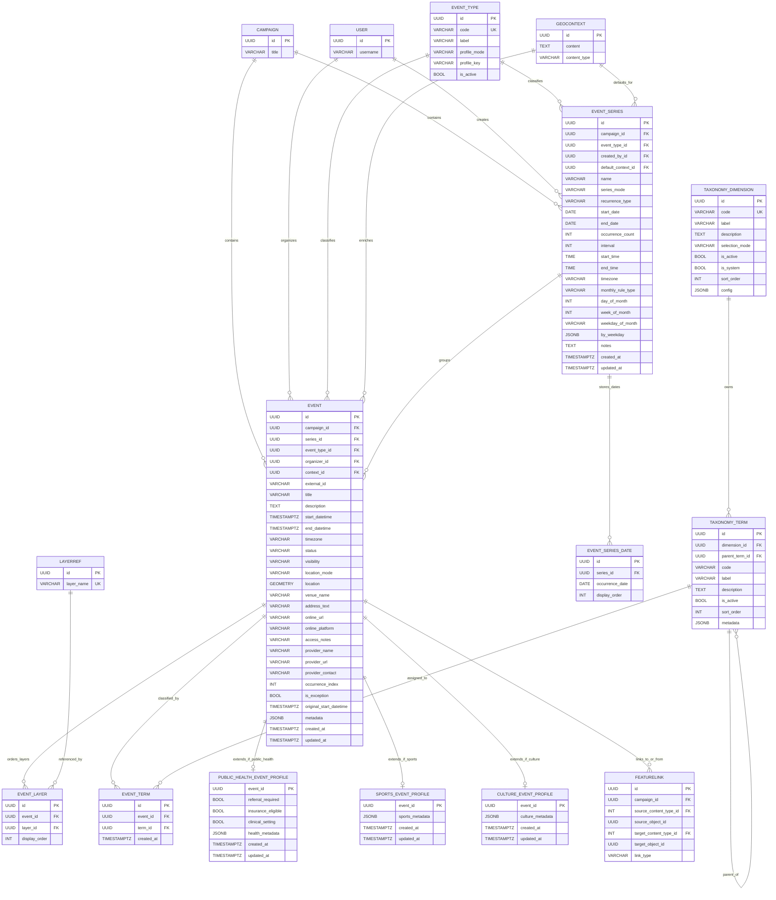
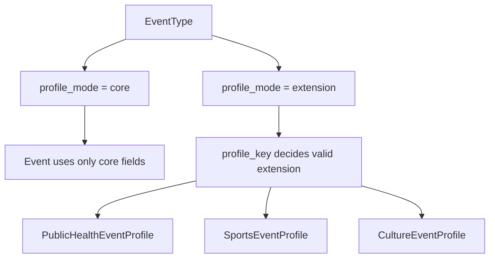
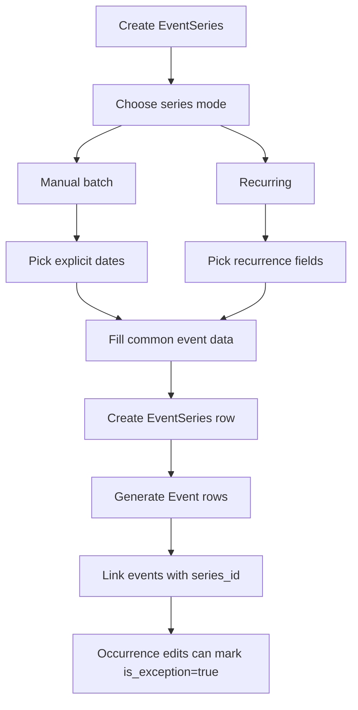

# Proposed Event Model

This document proposes the next event model for TOSCA-Backend based on:

- the current `CalendarEvent` implementation
- the existing campaign / context / layer / feature link architecture
- the more complex field structure extracted from `Kategoriensystem.xlsx`
- the requirement that location and provider stay inside the event core
- the requirement that taxonomy dimensions remain dynamic for open source reuse

Implementation note:

- the current codebase still uses `CalendarEvent`
- the final v2 implementation replaces `CalendarEvent` with `Event` after schema freeze
- because the system is not yet in production, rollout may use a destructive DB reset instead of row-level backfill

## Goals

- Keep one stable `Event` aggregate for all event domains.
- Keep event creation practical: one record should contain the data needed to publish an event.
- Support richer classification without hardcoding every category into schema columns.
- Allow different application owners to define their own taxonomy dimensions and terms.
- Allow future domain-specific extensions such as public health, sports, culture, and politics.
- Keep map semantics simple: only events with real spatial location appear on the map.

## Core Design Decisions

### 1. Event is the aggregate root

`Event` owns:

- schedule
- title and description
- location fields
- provider fields
- campaign and organizer references
- visibility and lifecycle state
- rich `GeoContext`

This keeps event creation simple and avoids creating premature `Location`, `Provider`, or `Venue` models.

`GeoContext` is optional enrichment rather than required identity data.

For recurring content, shared context lives on `EventSeries.default_context_id`.

Per-occurrence context lives on optional `Event.context_id` as an override.

Effective context resolution is:

- `event.context`
- else `series.default_context`
- else no context

This keeps one shared default for a series without making multiple events point at the same mutable content row directly.

Map behavior is intentionally simplified:

- `physical` events appear on the map
- `hybrid` events appear on the map
- `online` events do not render as spatial markers on the map
- map-screen responses still include `online` events as a separate non-spatial collection
- spatial filters apply only to `physical` and `hybrid`
- `online` events still honor all non-spatial filters such as campaign, date, taxonomy, status, and search

### 2. Taxonomy is normalized, but dimensions are dynamic

Instead of hardcoding dimensions like `topic`, `language`, or `cost_type` as an enum inside `TaxonomyTerm`, the proposal introduces:

- `TaxonomyDimension`: the bucket definition
- `TaxonomyTerm`: a term inside one dimension
- `EventTerm`: the assignment from event to term

This avoids baking one product owner's vocabulary into the schema.

### 3. Hierarchy is supported inside a dimension

`TaxonomyTerm.parent_term_id` allows:

- broad-to-specific trees
- roll-up analytics
- cleaner filter UIs
- mapping workbook pairs like `topic` -> `topicFocus`

### 4. Domain-specific data lives in extension profiles

`Event` remains stable. Special fields live in 1:1 extension tables such as:

- `core` (no extension table required)
- `PublicHealthEventProfile`
- `SportsEventProfile`
- `CultureEventProfile`

The intended implementation is a combination of:

- application-level validation
- an `EventType` registry that declares which profile mode is allowed

This makes the binding explicit instead of relying only on convention.

### 5. Recurring and batch creation use a lightweight EventSeries model

Recurring events are not modeled through `Campaign`.

`Campaign` answers:

- which initiative this belongs to

`EventSeries` answers:

- which event occurrences belong together
- which occurrences were generated from one recurring or batch definition
- which event is session 3 of 8
- which occurrences were later edited as exceptions

The proposal keeps all normal event data on `Event`. `EventSeries` stores only:

- grouping identity
- generation mode
- recurrence parameters
- explicit selected dates for manual batches
- management metadata

This keeps `Event` as the source of truth while still supporting recurring workflows.

## Proposed ER Diagram



## Event Type to Profile Binding

`EventType` is the registry that tells the system how an event should be shaped beyond the core table.

Suggested fields on `EventType`:

- `code`: stable type key such as `public_health`
- `label`: human-readable label
- `profile_mode`: one of `core` or `extension`
- `profile_key`: nullable key such as `public_health`, `sports`, `culture`

Recommended semantics:

- `profile_mode=core` means the event is fully represented by `Event` core fields and no extension table is expected.
- `profile_mode=extension` means exactly one matching extension profile may exist.
- `profile_key` identifies which extension profile is valid.

Examples:

| event_type.code | profile_mode | profile_key | meaning |
| --- | --- | --- | --- |
| `general` | `core` | `NULL` | no extension table needed |
| `public_health` | `extension` | `public_health` | use `PublicHealthEventProfile` |
| `sports` | `extension` | `sports` | use `SportsEventProfile` |
| `culture` | `extension` | `culture` | use `CultureEventProfile` |

This is intentionally a combination of:

- application-level validation
- a data-driven registry

That combination gives:

- clear platform behavior
- explicit configuration in data
- flexibility for open source deployments

## Profile Binding Flow



## Recurring Events and Event Series

### Why we need this

Without a series model, the system can create multiple events in bulk, but it cannot reliably answer:

- which events belong to the same course or recurring offering
- which event is occurrence 4 of 8
- whether one event was manually changed after generation
- how to update future occurrences without overwriting edited ones

That leads to weak UX and weak data semantics:

- bulk-created rows become unrelated events
- stakeholders cannot track a course as a unit
- developers cannot safely implement "edit this occurrence" versus "edit all future occurrences"

`EventSeries` fixes that by giving the system a stable relation model for grouped events.

### What problem it fixes

It fixes the gap between:

- one-off event creation
- batch creation of multiple dates
- recurring event generation

The feature is not just "create many rows faster". It creates explicit structure for:

- recurring courses
- workshop series
- scheduled multi-session programs
- manually batched events that should still be treated as related

### How it works

Workflow:

1. User starts event series creation.
2. User enters series-level information:
   - `name`
   - `series_mode`
   - recurrence fields or explicit dates
3. User enters the common event information that should be copied into occurrences.
4. System creates one `EventSeries` row.
5. System creates one `Event` row per occurrence.
6. Each generated event gets:
   - `series_id`
   - `occurrence_index`
   - `original_start_datetime`
   - `is_exception=False`
   - inherited `campaign_id` and `event_type_id` from the series

Later, if an individual occurrence is edited in a way that diverges from the generated series definition, the event becomes an exception.

While an occurrence remains attached to a series, it stays bound to that series for:

- `campaign_id`
- `event_type_id`

If an occurrence needs a different campaign or event type, it should be detached from the series first.

### Why event data stays on Event

The proposal does not make `EventSeries` a template copy of all event fields.

That is intentional because:

- `Event` remains the authoritative entity shown in list and map APIs
- per-occurrence edits stay simple
- event-specific content, status, and geometry do not need to be synchronized from a template table
- the series model stays focused on relation and generation semantics

Series exceptions may diverge on:

- schedule
- content
- location

Series exceptions should not diverge on `campaign_id` or `event_type_id` while still attached to the series.

### EventSeries fields

Recommended fields:

- identity:
  - `id`
  - `campaign_id`
  - `event_type_id`
  - `created_by_id`
  - `default_context_id`
  - `name`
- generation mode:
  - `series_mode`
    - `manual_batch`
    - `recurring`
- recurrence definition:
  - `recurrence_type`
    - `daily`
    - `weekly`
    - `monthly`
  - `start_date`
  - `end_date`
  - `occurrence_count`
  - `interval`
  - `start_time`
  - `end_time`
  - `timezone`
  - `by_weekday`
  - `monthly_rule_type`
  - `day_of_month`
  - `week_of_month`
  - `weekday_of_month`
- explicit date definition for manual batches:
  - one `EventSeriesDate` row per selected date
- management:
  - `notes`
  - `created_at`
  - `updated_at`

### Why regular form fields instead of JSON

Users should not configure recurrence with raw JSON.

They should use normal form fields such as:

- date picker
- weekday selector
- time picker
- occurrence count input
- interval input

The recurrence model is still structured, but the authoring interface remains understandable.

### Recommended form behavior

For `manual_batch`:

- user selects multiple explicit dates
- user enters common event details
- system creates one occurrence per selected date
- selected dates are stored in `EventSeriesDate`

For `recurring`:

- user selects recurrence type
- form reveals only the relevant fields for that type

Examples:

- weekly:
  - every `N` weeks
  - weekdays
  - start date
  - end date or occurrence count
- monthly:
  - every `N` months
  - by day-of-month or nth weekday

### Suggested recurring-events diagram



## Entity Responsibilities

### Event

`Event` is the main domain entity. It should be sufficient to create, edit, publish, and query events without forcing joins to secondary tables for basic operations.

Recommended core fields:

- identification: `id`, `external_id`
- ownership: `campaign_id`, `organizer_id`
- typing: `event_type_id`
- content: `title`, `description`, `context_id`
- schedule: `start_datetime`, `end_datetime`, `timezone`
- computed: `duration_minutes` (derived from `start_datetime` and `end_datetime`)
- lifecycle: `status`, `visibility`
- location: `location_mode`, `location`, `venue_name`, `address_text`, `online_url`, `online_platform`, `access_notes`
- provider: `provider_name`, `provider_url`, `provider_contact`
- flexible extras: `metadata`

Spatial semantics:

- `location` is the real map geometry
- `location_mode=online` means the event is non-spatial for map rendering
- no target-area geometry or target-area relation is used in this simplified proposal
- map responses return online events separately from spatial GeoJSON
- `series_id` links an event to a recurring or batch group when applicable
- `occurrence_index` stores series ordering
- `is_exception` marks an occurrence that diverged from the original generated series definition

### EventSeries

`EventSeries` is a grouping and recurrence-definition model.

It is not the canonical event data store. Its job is to:

- express relation between occurrences
- persist how the series was generated
- support batch and recurring creation
- enable "edit this event" versus "edit future events" workflows
- hold the default shared context for the series

Examples:

- 8-week self-awareness course
- 6-session Pilates class
- manually selected set of open-house dates

### EventSeriesDate

`EventSeriesDate` stores explicit chosen dates for `manual_batch` series.

This avoids:

- losing the original user selection after events are generated
- storing a raw JSON date list
- treating manual batches as opaque one-time generation requests

### Time and Timezone Rules

Concrete event datetimes use `TIMESTAMPTZ`.

Recurrence definitions use:

- local wall-clock fields such as `start_time` and `end_time`
- a required IANA timezone such as `Europe/Berlin`

Recurring expansion happens in `EventSeries.timezone`, not in UTC.

DST rule:

- recurring occurrences keep the same local time in the series timezone across DST transitions
- UTC instants may shift when DST changes

### TaxonomyDimension

`TaxonomyDimension` defines a classification bucket.

Examples:

- `topic`
- `target_group`
- `language`
- `accessibility`
- `cost_type`
- `provider_type`
- `custom_audience_segment`

This is dynamic on purpose so different deployments can define their own dimensions.

Suggested fields:

- `code`: stable machine key such as `topic`
- `label`: human-readable label
- `selection_mode`: `single` or `multiple`
- `is_system`: whether the dimension is platform-provided and protected
- `config`: optional UI and validation settings

### TaxonomyTerm

`TaxonomyTerm` defines one allowed value in one dimension.

Examples:

- dimension `topic` -> term `physical_health`
- dimension `topic` -> term `cardiovascular`
- dimension `target_group` -> term `seniors`
- dimension `language` -> term `german`

### EventTerm

`EventTerm` is the join table that attaches taxonomy terms to events.

It exists because:

- an event can have many terms
- the same term can be used by many events
- terms remain reusable and manageable

### Extension Profiles

Extension profiles hold only fields that do not belong in all events.

Examples:

- no profile row for `profile_mode=core`
- `PublicHealthEventProfile.insurance_eligible`
- `PublicHealthEventProfile.referral_required`

The enforcement rule should be:

- `EventType.profile_mode=core` -> no extension profile row is expected
- `EventType.profile_mode=extension` -> only the matching profile table is valid
- mismatched profile rows must be rejected

## Why Dynamic Dimensions Instead of an Enum

An enum-based `dimension` field assumes the product team already knows every dimension the platform will ever need.

That assumption is too narrow for an open source platform. Different adopters may need:

- public health dimensions
- culture-specific dimensions
- sports-specific dimensions
- custom local categories
- domain-specific filters that do not exist today

Dynamic dimensions let owners add those categories without a schema migration.

Use a table instead of an enum when:

- the platform is meant to be adapted by third parties
- administrators may define new classification buckets
- the same backend should support multiple domains

## Why Support Parent / Child Terms

Hierarchy solves three real problems:

- broad filters: searching for `physical_health` can include all subtopics
- analytics rollups: `cardiovascular` events can count under `physical_health`
- workbook mapping: pairs like `topic` / `topicFocus` map naturally to parent / child terms

Examples:

- `physical_health`
  - `cardiovascular`
  - `respiratory`
- `provider_type`
  - `hospital`
  - `ngo`
  - `insurance`

Hierarchy is optional per term. Flat dimensions can still exist.

## Constraints

### Event constraints

- `campaign_id` is required.
- `event_type_id` is required.
- `organizer_id` is required.
- `title` is required and sanitized.
- `end_datetime >= start_datetime`.
- `duration_minutes` is a computed property (not stored).
- `status` must be one of the supported lifecycle values.
- `visibility` must be one of the supported access values.
- `location_mode` must be one of `physical`, `online`, `hybrid`.
- `online_url` is required when `location_mode` is `online`.
- `location` is required when `location_mode` is `physical`.
- `location` and `online_url` are required when `location_mode` is `hybrid`.
- `location` should be empty or ignored when `location_mode` is `online`.
- if `series_id` is present, `occurrence_index >= 1`.
- `(series_id, occurrence_index)` should be unique when `series_id` is not null.
- if `is_exception=True`, `series_id` must be present.
- if `is_exception=True` because of a datetime override, `original_start_datetime` should be preserved.

### TaxonomyDimension constraints

- `code` must be globally unique.
- `selection_mode` must be one of `single` or `multiple`.
- `sort_order >= 0`.

### TaxonomyTerm constraints

- `dimension_id` is required.
- `(dimension_id, code)` must be unique.
- parent and child must belong to the same dimension.
- cycles in the parent chain must be rejected (enforced via parent chain traversal with a max depth of 10).
- `sort_order >= 0`.

### EventTerm constraints

- `(event_id, term_id)` must be unique.
- a term from an inactive dimension should not be assignable.
- if the dimension has `selection_mode=single`, only one term from that dimension may be attached to the event.

### Extension profile constraints

- profile row must exist only for matching `event_type`.
- `event_type.profile_mode=core` must not have an extension profile row.
- `event_type.profile_mode=extension` may require exactly one matching profile row, depending on product rules.
- `event_id` is both PK and FK to `Event.id`.

### EventSeries constraints

- `campaign_id` is required.
- `event_type_id` is required.
- `created_by_id` is required.
- `series_mode` must be one of `manual_batch` or `recurring`.
- `recurrence_type` is required when `series_mode=recurring`.
- `manual_batch` series must have at least one `EventSeriesDate`.
- exactly one termination strategy should be used for recurring series:
  - `end_date`
  - or `occurrence_count`
- `interval >= 1`.
- `occurrence_count >= 1` when present.
- same-day events: `end_time > start_time`. Multi-day events: `end_date` combined with `end_time` must be after `start_date` combined with `start_time`.
- weekly recurrence requires at least one weekday.
- `by_weekday` values must be valid day names (`monday` through `sunday`).
- monthly recurrence requires a `monthly_rule_type`:
  - `day_of_month` requires `day_of_month` value
  - `nth_weekday` requires `week_of_month` and `weekday_of_month` values

Note:

- the "must have at least one `EventSeriesDate`" rule is best enforced in the service layer or serializer transaction, because related dates may not yet exist during the first `EventSeries.clean()` call.

### EventSeriesDate constraints

- `(series_id, occurrence_date)` must be unique.
- `display_order >= 1`.

## Validation Rules

Validation should exist at two levels:

- database constraints for integrity
- Django `clean()` / serializer validation for user-facing errors

Recommended validation logic:

1. Validate schedule consistency.
2. Validate location consistency based on `location_mode`.
3. Validate taxonomy assignments against `selection_mode`.
4. Validate taxonomy parent-child dimension consistency.
5. Detect and reject cycles in taxonomy parent chains (max depth 10).
6. Validate extension profile existence against `event_type.profile_mode` and `event_type.profile_key`.
7. Validate series recurrence definition including weekday values and monthly rules.
8. Validate generated occurrences against the series.
9. Sanitize all simple text fields before persistence.

Recurring-specific validation rules:

- `manual_batch` must provide at least one persisted `EventSeriesDate`.
- selected explicit dates must be unique.
- generated occurrence datetimes must be unique within one series unless duplicate sessions are explicitly allowed.
- a generated event moved to a different datetime should be marked `is_exception=True`.
- if a user edits an individual occurrence datetime, the system should preserve `original_start_datetime`.
- if a future series update would overwrite an exception occurrence, the exception must be skipped unless the user explicitly chooses to reset it.

## Example Data

### Example dimensions

| code | label | selection_mode |
| --- | --- | --- |
| `topic` | Topic | `multiple` |
| `target_group` | Target Group | `multiple` |
| `language` | Language | `multiple` |
| `cost_type` | Cost Type | `single` |
| `provider_type` | Provider Type | `single` |

### Example terms

| dimension | code | label | parent |
| --- | --- | --- | --- |
| `topic` | `physical_health` | Physical Health | `NULL` |
| `topic` | `cardiovascular` | Cardiovascular | `physical_health` |
| `target_group` | `seniors` | Seniors | `NULL` |
| `language` | `german` | German | `NULL` |
| `provider_type` | `insurance` | Insurance Provider | `NULL` |

### Example event

| field | value |
| --- | --- |
| `title` | Heart Health Screening Day |
| `event_type` | `public_health` |
| `location_mode` | `physical` |
| `address_text` | Example Clinic, Hamburg |
| `provider_name` | Health Insurance A |
| `start_datetime` | `2026-05-12T09:00:00+02:00` |
| `end_datetime` | `2026-05-12T13:00:00+02:00` |
| `visibility` | `public` |

### Example event-term assignments

| event | term |
| --- | --- |
| Heart Health Screening Day | `cardiovascular` |
| Heart Health Screening Day | `seniors` |
| Heart Health Screening Day | `german` |
| Heart Health Screening Day | `insurance` |

### Example recurring series

| field | value |
| --- | --- |
| `name` | Self-Awareness Course Spring 2026 |
| `series_mode` | `recurring` |
| `recurrence_type` | `weekly` |
| `interval` | `1` |
| `start_date` | `2026-04-07` |
| `occurrence_count` | `8` |
| `by_weekday` | `["tuesday"]` |
| `start_time` | `18:00` |
| `end_time` | `19:30` |
| `timezone` | `Europe/Berlin` |

Generated occurrences:

| occurrence_index | start_datetime | end_datetime |
| --- | --- | --- |
| `1` | `2026-04-07T18:00:00+02:00` | `2026-04-07T19:30:00+02:00` |
| `2` | `2026-04-14T18:00:00+02:00` | `2026-04-14T19:30:00+02:00` |
| `3` | `2026-04-21T18:00:00+02:00` | `2026-04-21T19:30:00+02:00` |

### Example manual batch series dates

| display_order | occurrence_date |
| --- | --- |
| `1` | `2026-05-03` |
| `2` | `2026-05-17` |
| `3` | `2026-06-01` |

## How the Workbook Maps to This Model

The extracted workbook structure maps cleanly:

- `offerType` -> taxonomy dimension
- `offerFocus` -> child term or secondary term in the same dimension
- `topic` -> taxonomy dimension
- `topicFocus` -> child term in the same dimension
- `targetGroup` -> taxonomy dimension
- `setting` -> taxonomy dimension
- `participationMode` -> taxonomy dimension
- `costType` -> taxonomy dimension
- `accessibility` -> taxonomy dimension
- `languageSupport` -> taxonomy dimension
- `providerType` -> taxonomy dimension
- `providerTypeFocus` -> child term

Free-text fields from the workbook belong in `Event` core:

- `name` -> `title`
- `description` -> `description`
- `location` -> `address_text` or `venue_name`
- `startDate`, `endDate`, `Time`, `Duration` -> schedule fields
- `provider`, `URL / Social Media`, `contact` -> provider fields

## Python Model Snippets

These are proposal snippets, not drop-in production code.

Implementation sequencing notes after 2B.4:

- The live code already includes minimal placeholder `EventType` and `EventSeries` models because `2B.2` referenced them before `2B.7` and `2B.12`.
- `Event.context` is already implemented as a nullable override `ForeignKey`, and effective context resolution already follows `event.context -> series.default_context -> none`.
- The GiST requirement for `Event.location` is currently satisfied by GeoDjango's implicit spatial index.
- Later tasks should extend the existing placeholder `EventType` and `EventSeries` models in place instead of reintroducing them.
- Because the new event rollout allows destructive resets, schema tightening can prefer direct reshaping over compatibility backfills.

```python
import uuid

from django.conf import settings
from django.contrib.contenttypes.fields import GenericRelation
from django.contrib.gis.db import models as gis_models
from django.core.exceptions import ValidationError
from django.core.validators import MinValueValidator
from django.db import models

from tosca_api.apps.core.models import TimeStampedModel
from tosca_api.apps.core.sanitization import sanitize_simple


class EventType(models.Model):
    id = models.UUIDField(primary_key=True, default=uuid.uuid4, editable=False)
    code = models.SlugField(unique=True)
    label = models.CharField(max_length=255)
    profile_mode = models.CharField(max_length=20, default="core")
    profile_key = models.SlugField(blank=True, default="")
    is_active = models.BooleanField(default=True)


class TaxonomyDimension(models.Model):
    class SelectionMode(models.TextChoices):
        SINGLE = "single", "Single"
        MULTIPLE = "multiple", "Multiple"

    id = models.UUIDField(primary_key=True, default=uuid.uuid4, editable=False)
    code = models.SlugField(unique=True)
    label = models.CharField(max_length=255)
    description = models.TextField(blank=True, default="")
    selection_mode = models.CharField(
        max_length=20,
        choices=SelectionMode.choices,
        default=SelectionMode.MULTIPLE,
    )
    is_active = models.BooleanField(default=True)
    is_system = models.BooleanField(default=False)
    sort_order = models.PositiveIntegerField(default=0)
    config = models.JSONField(default=dict, blank=True)


class TaxonomyTerm(models.Model):
    id = models.UUIDField(primary_key=True, default=uuid.uuid4, editable=False)
    dimension = models.ForeignKey(
        TaxonomyDimension,
        on_delete=models.CASCADE,
        related_name="terms",
    )
    parent = models.ForeignKey(
        "self",
        on_delete=models.PROTECT,
        null=True,
        blank=True,
        related_name="children",
    )
    code = models.SlugField()
    label = models.CharField(max_length=255)
    description = models.TextField(blank=True, default="")
    is_active = models.BooleanField(default=True)
    sort_order = models.PositiveIntegerField(default=0)
    metadata = models.JSONField(default=dict, blank=True)

    class Meta:
        constraints = [
            models.UniqueConstraint(
                fields=["dimension", "code"],
                name="uq_taxonomy_term_dimension_code",
            ),
        ]

    def clean(self):
        errors = {}

        if self.parent and self.parent.dimension_id != self.dimension_id:
            errors["parent"] = "Parent must be in the same dimension."

        # Cycle detection: walk the parent chain up to a max depth
        if self.parent:
            MAX_DEPTH = 10
            visited = {self.pk}
            current = self.parent
            depth = 0
            while current is not None and depth < MAX_DEPTH:
                if current.pk in visited:
                    errors["parent"] = "Circular parent chain detected."
                    break
                visited.add(current.pk)
                current = current.parent
                depth += 1
            if depth >= MAX_DEPTH:
                errors["parent"] = f"Parent chain exceeds maximum depth of {MAX_DEPTH}."

        if errors:
            raise ValidationError(errors)


class Event(TimeStampedModel):
    class Status(models.TextChoices):
        DRAFT = "draft", "Draft"
        PUBLISHED = "published", "Published"
        CANCELLED = "cancelled", "Cancelled"
        ARCHIVED = "archived", "Archived"

    class Visibility(models.TextChoices):
        PUBLIC = "public", "Public"
        PRIVATE = "private", "Private"

    class LocationMode(models.TextChoices):
        PHYSICAL = "physical", "Physical"
        ONLINE = "online", "Online"
        HYBRID = "hybrid", "Hybrid"

    id = models.UUIDField(primary_key=True, default=uuid.uuid4, editable=False)
    external_id = models.CharField(max_length=255, blank=True, default="")
    campaign = models.ForeignKey(
        "campaigns.Campaign",
        on_delete=models.CASCADE,
        related_name="events",
    )
    event_type = models.ForeignKey(EventType, on_delete=models.PROTECT)
    organizer = models.ForeignKey(
        settings.AUTH_USER_MODEL,
        on_delete=models.PROTECT,
        related_name="organized_events",
    )
    title = models.CharField(max_length=255)
    description = models.TextField(blank=True, default="")
    context = models.ForeignKey(
        "geocontext.GeoContext",
        on_delete=models.SET_NULL,
        null=True,
        blank=True,
        related_name="events",
    )
    start_datetime = models.DateTimeField()
    end_datetime = models.DateTimeField()
    timezone = models.CharField(max_length=64, default="UTC")
    status = models.CharField(
        max_length=20,
        choices=Status.choices,
        default=Status.DRAFT,
        db_index=True,
    )
    visibility = models.CharField(
        max_length=20,
        choices=Visibility.choices,
        default=Visibility.PUBLIC,
    )
    location_mode = models.CharField(
        max_length=20,
        choices=LocationMode.choices,
        default=LocationMode.PHYSICAL,
    )
    location = gis_models.PointField(srid=4326, null=True, blank=True)
    venue_name = models.CharField(max_length=255, blank=True, default="")
    address_text = models.TextField(blank=True, default="")
    online_url = models.URLField(blank=True, default="")
    online_platform = models.CharField(max_length=255, blank=True, default="")
    access_notes = models.TextField(blank=True, default="")
    provider_name = models.CharField(max_length=255, blank=True, default="")
    provider_url = models.URLField(blank=True, default="")
    provider_contact = models.TextField(blank=True, default="")
    series = models.ForeignKey(
        "EventSeries",
        on_delete=models.SET_NULL,
        null=True,
        blank=True,
        related_name="events",
    )
    occurrence_index = models.PositiveIntegerField(null=True, blank=True)
    is_exception = models.BooleanField(default=False)
    original_start_datetime = models.DateTimeField(null=True, blank=True)
    metadata = models.JSONField(default=dict, blank=True)

    layers = models.ManyToManyField(
        "layerrefs.LayerRef",
        through="EventLayer",
        related_name="events",
        blank=True,
    )

    # Reverse generic relations for cascading deletes of FeatureLinks
    feature_links_source = GenericRelation(
        "featurelinks.FeatureLink",
        content_type_field="source_content_type",
        object_id_field="source_object_id",
        related_query_name="event_source",
    )
    feature_links_target = GenericRelation(
        "featurelinks.FeatureLink",
        content_type_field="target_content_type",
        object_id_field="target_object_id",
        related_query_name="event_target",
    )

    @property
    def duration_minutes(self):
        """Computed from start_datetime and end_datetime."""
        if self.start_datetime and self.end_datetime:
            delta = self.end_datetime - self.start_datetime
            return int(delta.total_seconds() / 60)
        return None

    def clean(self):
        errors = {}

        if self.end_datetime < self.start_datetime:
            errors["end_datetime"] = "End must be after start."

        if self.location_mode == self.LocationMode.ONLINE and not self.online_url:
            errors["online_url"] = "Online events require an online URL."

        if self.location_mode == self.LocationMode.ONLINE and self.location:
            errors["location"] = "Online events should not have map geometry."

        if self.location_mode == self.LocationMode.PHYSICAL and not (
            self.location or self.address_text or self.venue_name
        ):
            errors["location_mode"] = "Physical events require a physical location."

        if self.location_mode == self.LocationMode.HYBRID:
            if not self.online_url:
                errors["online_url"] = "Hybrid events require an online URL."
            if not (self.location or self.address_text or self.venue_name):
                errors["location_mode"] = "Hybrid events require a physical location."

        if self.is_exception and not self.series_id:
            errors["is_exception"] = "Only series events can be marked as exceptions."

        if self.series_id and self.occurrence_index is None:
            errors["occurrence_index"] = "Series events require an occurrence index."

        if errors:
            raise ValidationError(errors)

    def save(self, *args, **kwargs):
        self.title = sanitize_simple(self.title)
        self.description = sanitize_simple(self.description)
        self.full_clean()
        super().save(*args, **kwargs)


VALID_WEEKDAYS = frozenset(
    ["monday", "tuesday", "wednesday", "thursday", "friday", "saturday", "sunday"]
)


class EventSeries(TimeStampedModel):
    class SeriesMode(models.TextChoices):
        MANUAL_BATCH = "manual_batch", "Manual Batch"
        RECURRING = "recurring", "Recurring"

    class RecurrenceType(models.TextChoices):
        DAILY = "daily", "Daily"
        WEEKLY = "weekly", "Weekly"
        MONTHLY = "monthly", "Monthly"

    class MonthlyRuleType(models.TextChoices):
        DAY_OF_MONTH = "day_of_month", "Day of Month"
        NTH_WEEKDAY = "nth_weekday", "Nth Weekday"

    id = models.UUIDField(primary_key=True, default=uuid.uuid4, editable=False)
    campaign = models.ForeignKey(
        "campaigns.Campaign",
        on_delete=models.CASCADE,
        null=True,
        blank=True,
    )
    event_type = models.ForeignKey(
        EventType,
        on_delete=models.PROTECT,
        null=True,
        blank=True,
    )
    created_by = models.ForeignKey(settings.AUTH_USER_MODEL, on_delete=models.PROTECT)
    default_context = models.ForeignKey(
        "geocontext.GeoContext",
        on_delete=models.SET_NULL,
        null=True,
        blank=True,
        related_name="default_for_event_series",
    )
    name = models.CharField(max_length=255)
    series_mode = models.CharField(max_length=20, choices=SeriesMode.choices)
    recurrence_type = models.CharField(
        max_length=20,
        choices=RecurrenceType.choices,
        blank=True,
        default="",
    )
    start_date = models.DateField()
    end_date = models.DateField(null=True, blank=True)
    occurrence_count = models.PositiveIntegerField(null=True, blank=True)
    interval = models.PositiveIntegerField(default=1)
    start_time = models.TimeField()
    end_time = models.TimeField()
    timezone = models.CharField(max_length=64, default="Europe/Berlin")
    monthly_rule_type = models.CharField(
        max_length=20,
        choices=MonthlyRuleType.choices,
        blank=True,
        default="",
    )
    day_of_month = models.PositiveSmallIntegerField(null=True, blank=True)
    week_of_month = models.PositiveSmallIntegerField(null=True, blank=True)
    weekday_of_month = models.CharField(max_length=20, blank=True, default="")
    by_weekday = models.JSONField(default=list, blank=True)
    notes = models.TextField(blank=True, default="")

    def clean(self):
        import datetime

        errors = {}

        if self.interval < 1:
            errors["interval"] = "Interval must be at least 1."

        # Validate using combined date + time to support multi-day events
        if self.start_date and self.start_time and self.end_time:
            start_dt = datetime.datetime.combine(self.start_date, self.start_time)
            # If end_time <= start_time, the event spans into the next day
            if self.end_date:
                end_dt = datetime.datetime.combine(self.end_date, self.end_time)
            else:
                end_dt = datetime.datetime.combine(self.start_date, self.end_time)
            if end_dt <= start_dt and not self.end_date:
                errors["end_time"] = (
                    "End time must be after start time for same-day events. "
                    "Use end_date for multi-day events."
                )

        if self.series_mode == self.SeriesMode.RECURRING:
            if not self.recurrence_type:
                errors["recurrence_type"] = "Recurring series require a recurrence type."
            if bool(self.end_date) == bool(self.occurrence_count):
                errors["end_date"] = "Use either end_date or occurrence_count."
            if self.recurrence_type == self.RecurrenceType.WEEKLY and not self.by_weekday:
                errors["by_weekday"] = "Weekly recurrence requires at least one weekday."

            # Validate by_weekday values
            if self.by_weekday:
                invalid = set(self.by_weekday) - VALID_WEEKDAYS
                if invalid:
                    errors["by_weekday"] = (
                        f"Invalid weekday values: {invalid}. "
                        f"Allowed: {sorted(VALID_WEEKDAYS)}."
                    )

            # Validate monthly recurrence rules
            if self.recurrence_type == self.RecurrenceType.MONTHLY:
                if not self.monthly_rule_type:
                    errors["monthly_rule_type"] = (
                        "Monthly recurrence requires a monthly rule type."
                    )
                elif self.monthly_rule_type == self.MonthlyRuleType.DAY_OF_MONTH:
                    if not self.day_of_month:
                        errors["day_of_month"] = (
                            "Day-of-month rule requires day_of_month."
                        )
                elif self.monthly_rule_type == self.MonthlyRuleType.NTH_WEEKDAY:
                    if not self.week_of_month or not self.weekday_of_month:
                        errors["monthly_rule_type"] = (
                            "Nth-weekday rule requires week_of_month and weekday_of_month."
                        )

        if self.series_mode == self.SeriesMode.MANUAL_BATCH and self.recurrence_type:
            errors["recurrence_type"] = "Manual batches must not define a recurrence type."

        if errors:
            raise ValidationError(errors)


class EventSeriesDate(models.Model):
    id = models.UUIDField(primary_key=True, default=uuid.uuid4, editable=False)
    series = models.ForeignKey(
        EventSeries,
        on_delete=models.CASCADE,
        related_name="dates",
    )
    occurrence_date = models.DateField()
    display_order = models.PositiveIntegerField(validators=[MinValueValidator(1)])

    class Meta:
        constraints = [
            models.UniqueConstraint(
                fields=["series", "occurrence_date"],
                name="uq_event_series_date",
            ),
        ]


class EventTerm(models.Model):
    id = models.UUIDField(primary_key=True, default=uuid.uuid4, editable=False)
    event = models.ForeignKey(Event, on_delete=models.CASCADE, related_name="event_terms")
    term = models.ForeignKey(
        TaxonomyTerm,
        on_delete=models.CASCADE,
        related_name="event_terms",
    )
    created_at = models.DateTimeField(auto_now_add=True)

    class Meta:
        constraints = [
            models.UniqueConstraint(
                fields=["event", "term"],
                name="uq_event_term",
            ),
        ]
```

## Example Test Cases

```python
import pytest
from django.core.exceptions import ValidationError


@pytest.mark.django_db
def test_online_event_requires_online_url(event_factory):
    event = event_factory(location_mode="online", online_url="")
    with pytest.raises(ValidationError):
        event.full_clean()


@pytest.mark.django_db
def test_online_event_rejects_map_geometry(event_factory, point_factory):
    event = event_factory(
        location_mode="online",
        online_url="https://example.org/live",
        location=point_factory(),
    )
    with pytest.raises(ValidationError):
        event.full_clean()


@pytest.mark.django_db
def test_event_rejects_end_before_start(event_factory):
    event = event_factory(
        start_datetime="2026-05-12T10:00:00Z",
        end_datetime="2026-05-12T09:00:00Z",
    )
    with pytest.raises(ValidationError):
        event.full_clean()


@pytest.mark.django_db
def test_hybrid_event_requires_location_and_online_url(event_factory, point_factory):
    event = event_factory(
        location_mode="hybrid",
        location=point_factory(),
        online_url="",
    )
    with pytest.raises(ValidationError):
        event.full_clean()


@pytest.mark.django_db
def test_series_event_requires_occurrence_index(event_factory, series_factory):
    series = series_factory()
    event = event_factory(series=series, occurrence_index=None)
    with pytest.raises(ValidationError):
        event.full_clean()


@pytest.mark.django_db
def test_exception_requires_series(event_factory):
    event = event_factory(is_exception=True, series=None)
    with pytest.raises(ValidationError):
        event.full_clean()


@pytest.mark.django_db
def test_taxonomy_term_parent_must_share_dimension(term_factory, dimension_factory):
    topic = dimension_factory(code="topic")
    language = dimension_factory(code="language")
    parent = term_factory(dimension=topic, code="physical_health")
    child = term_factory.build(dimension=language, parent=parent, code="german")

    with pytest.raises(ValidationError):
        child.full_clean()


@pytest.mark.django_db
def test_event_term_is_unique(event, term):
    EventTerm.objects.create(event=event, term=term)
    with pytest.raises(Exception):
        EventTerm.objects.create(event=event, term=term)


@pytest.mark.django_db
def test_single_select_dimension_allows_only_one_term(
    event, term_factory, dimension_factory
):
    cost_type = dimension_factory(code="cost_type", selection_mode="single")
    free = term_factory(dimension=cost_type, code="free")
    paid = term_factory(dimension=cost_type, code="self_pay")

    EventTerm.objects.create(event=event, term=free)

    with pytest.raises(ValidationError):
        validate_dimension_assignment(event=event, new_term=paid)


@pytest.mark.django_db
def test_public_health_profile_requires_public_health_event_type(
    public_health_profile_factory, event_factory, event_type_factory
):
    culture_type = event_type_factory(code="culture")
    event = event_factory(event_type=culture_type)

    with pytest.raises(ValidationError):
        public_health_profile_factory.build(event=event).full_clean()


@pytest.mark.django_db
def test_core_profile_mode_rejects_extension_profile(
    public_health_profile_factory, event_factory, event_type_factory
):
    general_type = event_type_factory(code="general", profile_mode="core")
    event = event_factory(event_type=general_type)

    with pytest.raises(ValidationError):
        public_health_profile_factory.build(event=event).full_clean()


@pytest.mark.django_db
def test_weekly_series_requires_weekday(series_factory):
    series = series_factory(
        series_mode="recurring",
        recurrence_type="weekly",
        by_weekday=[],
    )
    with pytest.raises(ValidationError):
        series.full_clean()


@pytest.mark.django_db
def test_recurring_series_requires_one_end_strategy(series_factory):
    series = series_factory(
        series_mode="recurring",
        recurrence_type="weekly",
        end_date="2026-06-01",
        occurrence_count=8,
    )
    with pytest.raises(ValidationError):
        series.full_clean()


@pytest.mark.django_db
def test_manual_batch_dates_must_be_unique(series_factory, series_date_factory):
    series = series_factory(series_mode="manual_batch")
    series_date_factory(series=series, occurrence_date="2026-05-03", display_order=1)

    with pytest.raises(Exception):
        series_date_factory(series=series, occurrence_date="2026-05-03", display_order=2)
```

## Edge Cases

- imported events may have only free-text location and no coordinates
- online events may have no physical address at all
- hybrid events require both physical location and URL
- an event type may switch from `core` to `extension` after data already exists
- a recurring series may contain an occurrence moved to another date or time
- a recurring series may contain one cancelled occurrence
- a user may edit one event in a series after generation
- a user may edit the series after some events have already been manually changed
- daylight saving time may shift perceived local event times
- manual batch creation may contain duplicate dates
- a manual batch series may later add or remove one explicit date
- taxonomy terms may become inactive after events were already tagged
- a parent term may be removed while children still exist
- two deployments may want different dimensions with the same label but different semantics
- imported source data may use inconsistent vocabulary that needs term mapping before ingestion
- `duration_minutes` is computed from `start_datetime` and `end_datetime` and cannot disagree
- events may exist without taxonomy terms during draft creation
- taxonomy parent chain may form cycles if validation is bypassed (enforced at max depth 10)

## Recommended Handling of Edge Cases

- allow draft events with incomplete taxonomy
- require stronger validation only at publish time
- treat `EventType` changes as controlled admin actions, not casual edits
- if imported physical events have no coordinates, keep them out of the map endpoint until geocoded or manually corrected
- when an occurrence datetime is changed manually, set `is_exception=True`
- store the generated datetime in `original_start_datetime` before manual override
- future series updates should update only non-exception future events by default
- provide an explicit reset action if the user wants to re-align an exception with the series
- validate generated datetimes against timezone-aware recurrence rules
- for manual batches, added dates should generate new occurrences and removed dates should only delete untouched future occurrences
- use `PROTECT` or soft-deactivation for taxonomy parents that still have children
- keep imported source IDs in `external_id`
- `duration_minutes` is always computed from `start_datetime` and `end_datetime`; no stored field to drift
- treat `metadata` as non-critical extension data, not as a substitute for first-class fields

## API and Query Implications

This proposal supports:

- a dedicated map API returning GeoJSON
- a dedicated list API returning paginated JSON
- recurring and manual-batch event generation
- linked event occurrences through `EventSeries`
- filter events by campaign
- filter events by time range
- spatial filtering by point geometry
- filter by one or more taxonomy dimensions
- aggregate by parent taxonomy terms for dashboards

Recommended endpoint split:

- `GET /api/v1/events/map/`
  - returns `spatial_events` as GeoJSON and `online_events` as a plain JSON collection
  - includes `physical` and `hybrid` events in `spatial_events`
  - includes `online` events in `online_events`
  - supports the same query parameters as the list endpoint
- `GET /api/v1/events/list/`
  - returns one chronological mixed paginated JSON stream
  - supports the same query parameters as the map endpoint
  - uses `location_mode` to distinguish `physical`, `hybrid`, and `online`
  - powers the floating online-event card and standard list view

Shared filter model:

- both endpoints accept the same filters
- only the response structure changes
- map endpoint returns GeoJSON features
- list endpoint returns list/detail-friendly JSON

Recommended shared filters:

- `campaign_id`
- `status`
- `visibility`
- `start_after`
- `start_before`
- `include_past`
- `location_mode`
- taxonomy filters such as `dimension`, `term`
- search filters such as free-text title or provider search
- geometry filters such as `bbox` or polygon `within`

Recommended semantics:

- map API and list API use the same filtering contract
- map API returns:
  - `spatial_events` as GeoJSON
  - `online_events` as a separate JSON collection
- list API returns one chronological mixed stream in non-GeoJSON form
- clients use `location_mode` to distinguish `physical`, `hybrid`, and `online`
- the frontend can render spatial features from `spatial_events` and render online events in the floating card or side-panel component
- when a geometry filter is present, spatial events are filtered by geometry and online events remain included
- non-spatial filters such as campaign, date, taxonomy, status, and search still apply to online events

Example behavior with `bbox`:

- `physical` and `hybrid` events must intersect the `bbox` to be included
- `online` events are still included in the separate non-spatial collection
- final result set = spatial matches plus online events that pass the other filters

Likely API patterns:

- `GET /api/v1/events/map/?campaign_id=...`
- `GET /api/v1/events/map/?bbox=...`
- `GET /api/v1/events/list/?campaign_id=...`
- `GET /api/v1/events/list/?term=cardiovascular`
- `GET /api/v1/events/list/?dimension=topic&term=cardiovascular`
- `GET /api/v1/events/list/?location_mode=online`
- `POST /api/v1/event-series/preview/`
- `POST /api/v1/event-series/`
- `PATCH /api/v1/event-series/{id}/`

Current implementation note:

- the `event-series` preview/create/update endpoints above are now implemented as the canonical recurrence authoring surface
- `PATCH /api/v1/event-series/{id}/` updates only future non-exception occurrences by default
- direct edits to generated occurrences through `/api/v1/events/{id}/` mark the row as `is_exception=true`
- recurring generation currently assumes same-day occurrence duration because `EventSeries.end_date` is already serving as the recurrence termination field; multi-day recurring occurrences would require explicit schema support later
- the shared event filter layer now supports `event_type_id` in addition to campaign/date/status/visibility/taxonomy filters
- event-series template `location` input is now validated as GeoJSON `Point` data at the serializer layer before model save

## Index Recommendations

- `event(campaign_id)`
- `event(start_datetime, end_datetime)`
- `event(event_type_id, status)`
- `event USING GIST(location)`
- `taxonomy_dimension(code)` unique
- `taxonomy_term(dimension_id, code)` unique
- `event_term(event_id, term_id)` unique
- `event_term(term_id)` for reverse filtering

## Migration Notes from Current CalendarEvent

The current implementation in [events/models.py](/Users/gokturkburakkose/Documents/dev/TOSCA-Backend/tosca_api/apps/events/models.py) can evolve incrementally:

1. Rename or conceptually replace `CalendarEvent` with `Event`.
2. Add `event_type`.
3. Add location mode and online/provider fields.
4. Split map and list API behavior by `location_mode`.
5. Add `EventSeries` plus `series_id`, `occurrence_index`, `is_exception`, and `original_start_datetime` on events.
6. Add `EventSeries.default_context` plus optional `Event.context` override, and keep `EventLayer` and `FeatureLink` patterns.
7. Introduce `TaxonomyDimension`, `TaxonomyTerm`, and `EventTerm`.
8. Add `PublicHealthEventProfile` after the core event migration is stable.

This avoids overloading the first migration with too many conceptual changes.

Practical note for local test environments: the repository uses a reusable `test_tosca` database in some workflows. After destructive event-schema changes, reset or repair that reusable test DB before treating failures involving old event tables or content types as current regressions.

## Summary

The proposed model keeps the parts that need to be simple inside `Event` core:

- location
- provider
- schedule
- basic content

It externalizes only the parts that need reuse, flexibility, or hierarchy:

- taxonomy dimensions
- taxonomy terms
- event-term assignments
- domain-specific extension profiles
- recurring relation and generation metadata in `EventSeries`

It also makes event type behavior explicit:

- some event types are `core` only
- some event types require an extension profile
- the allowed profile is declared by `EventType`

And it keeps spatial behavior simple:

- only `physical` and `hybrid` events have real geometry
- `online` events remain non-spatial and are returned separately from map GeoJSON
- map and list retrieval use separate APIs with the same filter contract

It also makes recurring behavior explicit:

- related occurrences are grouped by `EventSeries`
- each occurrence is still a normal `Event`
- per-occurrence edits are supported through exception tracking

That is the balance that best fits the conversation so far:

- simple authoring
- extensible classification
- open source adaptability
- future event domain support without repeated schema redesign
