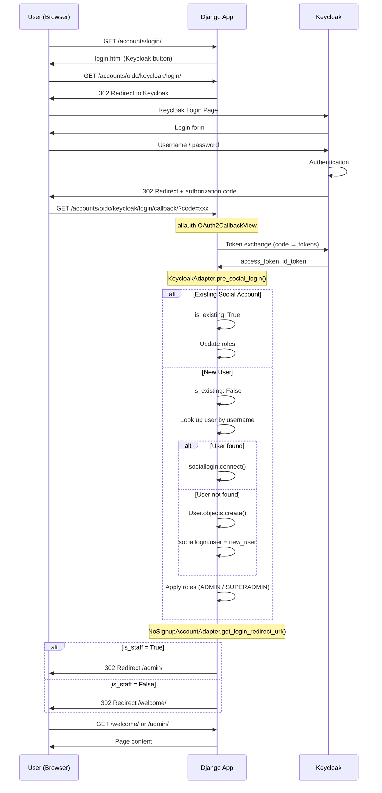

````mermaid
flowchart TB
    subgraph Django["Django App"]
        subgraph URLs["urls.py"]
            L["/accounts/login/"]
            C["/accounts/oidc/keycloak/login/callback/"]
            W["/welcome/"]
            A["/admin/"]
        end

        subgraph Views["views.py"]
            KRV["KeycloakRedirectView<br/>Show login.html"]
            WV["welcome_view<br/>Show welcome.html"]
        end

        subgraph Backends["backends.py"]
            KA["KeycloakAdapter<br/>(SocialAccountAdapter)"]
            NSA["NoSignupAccountAdapter<br/>(AccountAdapter)"]
            KTA["KeycloakTokenAuthentication<br/>(for API)"]
        end

        subgraph Adapters["Adapter Methods"]
            PSL["pre_social_login()<br/>• Create/Find User<br/>• Apply Roles"]
            GLR["get_login_redirect_url()<br/>• Admin → /admin/<br/>• User → /welcome/"]
        end
    end

    subgraph Keycloak["Keycloak"]
        KC["Auth Server"]
        OIDC["OIDC Provider"]
    end

    L --> KRV
    C --> KA
    KA --> PSL
    PSL --> GLR
    GLR --> W
    GLR --> A
    W --> WV
    ```
````
